# 🚀 Maverick Start Program — Engineering Pre-Assessment

**Payd Sacco** is a project whose target audience is users in a sacco setting, they can transact, deposit, transfer funds from one user to another using a wallet with a unique username, allowing users to own a wallet and use it in their day to day transactions.

---
**Target Audience**

Community groups / Sacco

---

## 📌 Submission Details

- **Name: Collins Rono**
- **Track: Fullstack**
- **Target audience: Community groups / Sacco**
- **Tech stack used:** `React & Laravel`
<!-- 3. **Update the `README.md`** in your fork to include:
   - Your name
   - Track (Frontend / Backend / Fullstack)
   - Target audience
   - Tech stack used
   - Feature list
   - Setup/run instructions
   - Your product thinking: what problem you chose, why, and how you solved it
   - (Optional but encouraged) Link to video walkthrough (2-4 mins)
4. Once you’re done, invite @rocks-xebec to the repository and send an email of the assessment to ravens@payd.money . -->

---

# Feature List

# User Registration

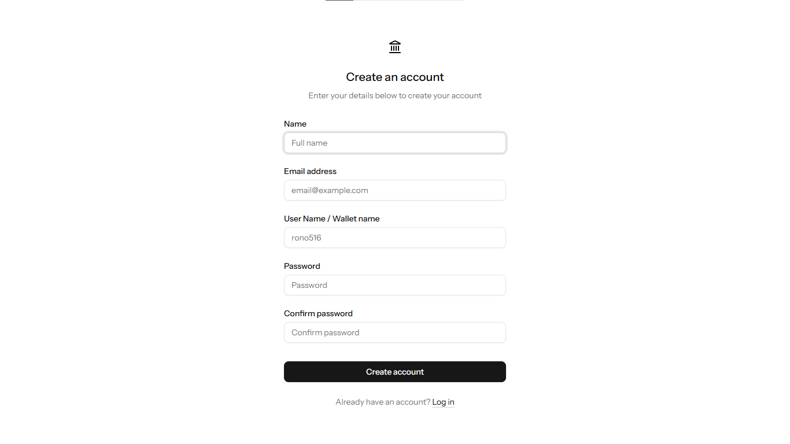

# User Login

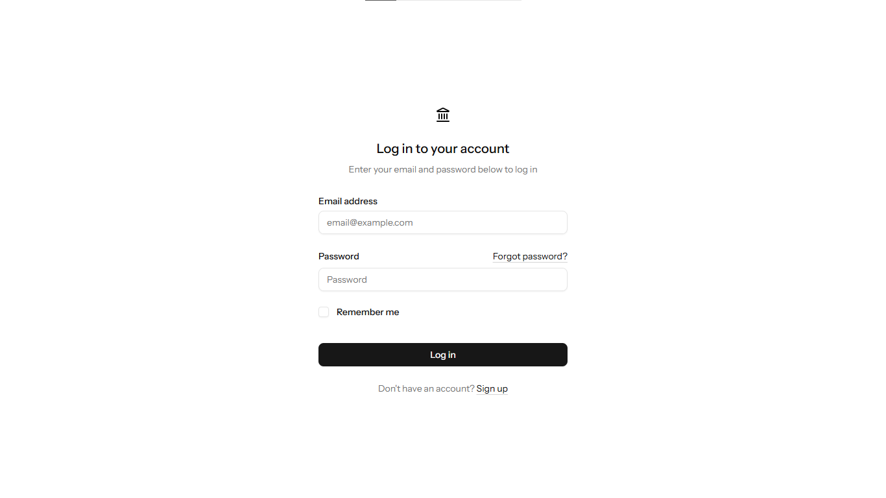

# Dashboard , Wallet overview, Transactions & Savings Balances, Transactions history

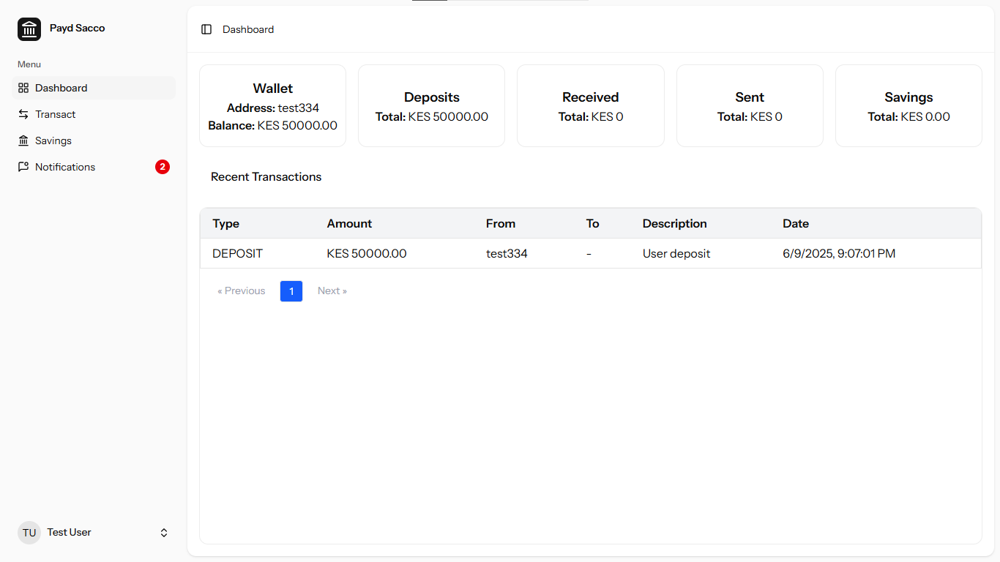

# Transaction Page for Deposit , Wallet to Wallet transfer

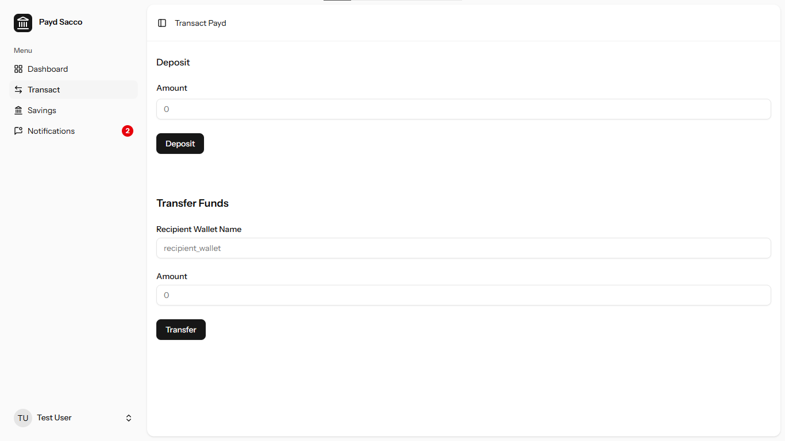

# Savings Overview , Balance , Target & Progress

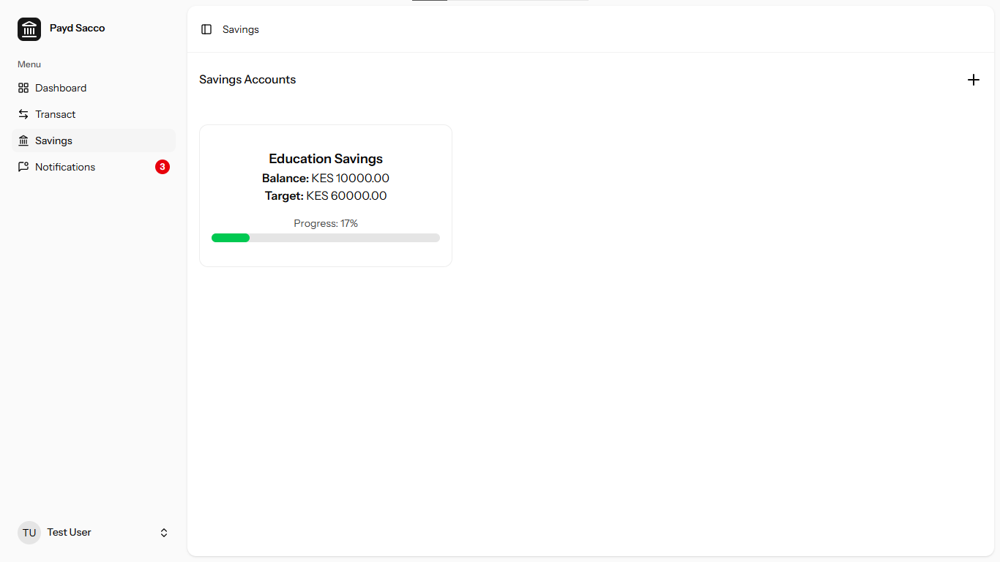

# Create New Savings, Target, Description

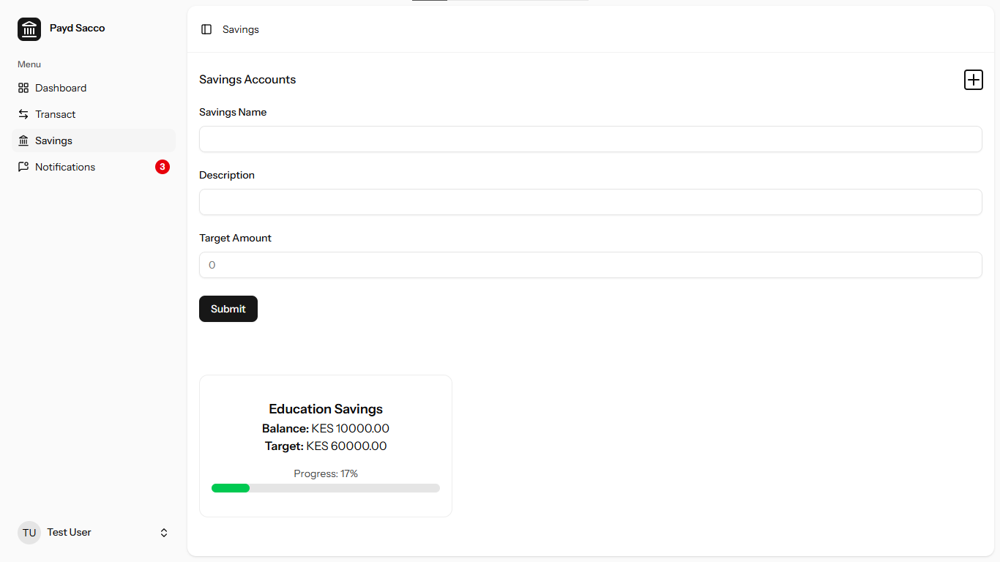

# Wallet to Savings Transfer

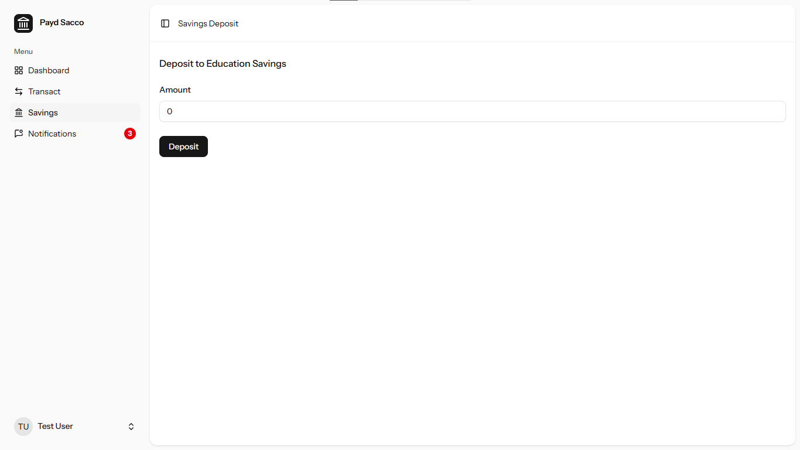

# Notifications on deposits, transfers, received transactions , new savings account

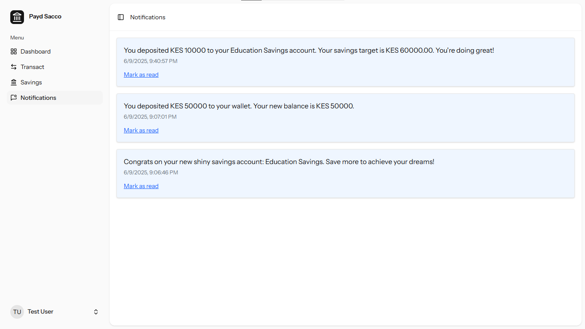

# Profile Update, Password Management, Light/Dark Theme toggle

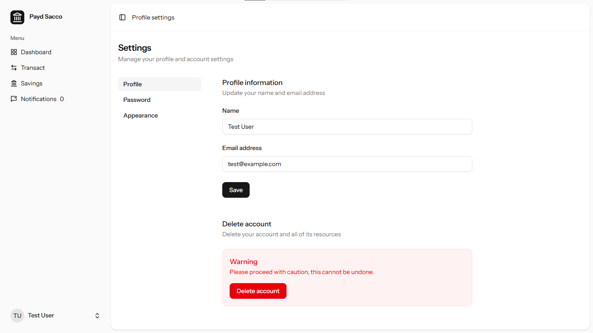

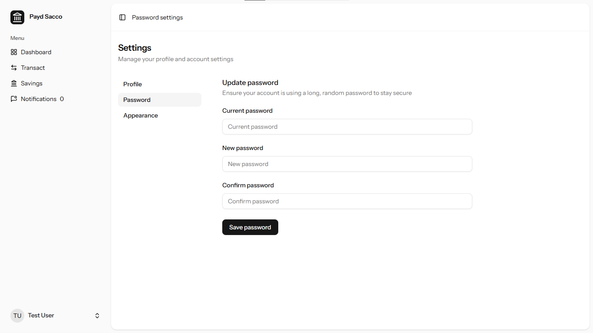

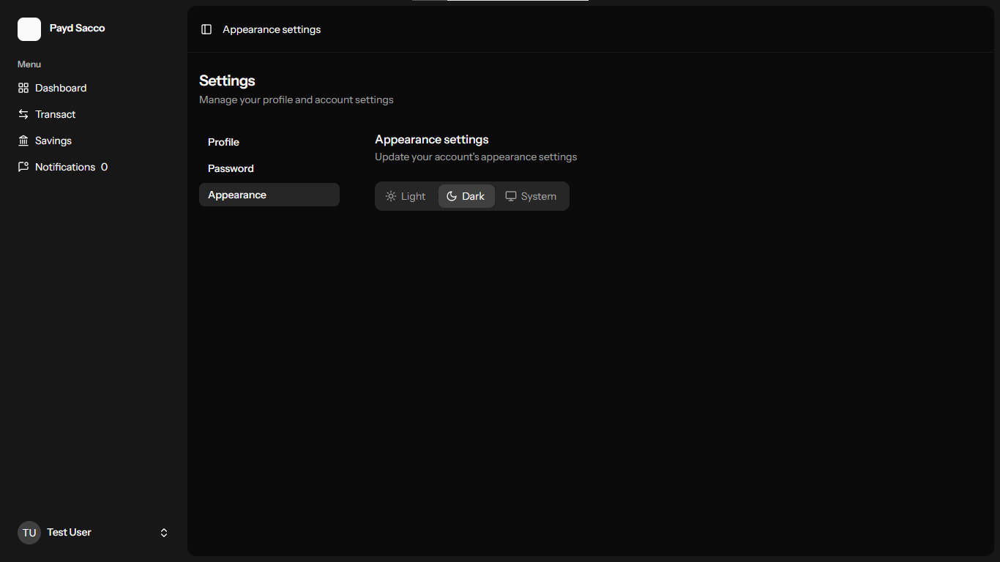

